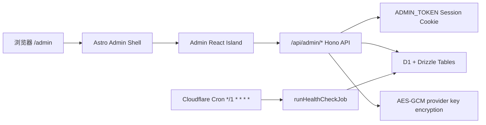

# Workers Admin Console 设计规格

## 本规格使用 skills

- `using-superpowers`：检查本阶段适用技能。
- `karpathy-guidelines`：约束范围、避免 speculative features，并定义可验证验收标准。
- `brainstorming`：把「把 admin 做进来」收敛为明确的产品与工程边界。
- `shape`：确定管理台 UX 方向、关键状态和交互模型。
- `impeccable`：约束前端视觉质量，避免泛化 admin 模板和无意义说明文案。
- `chinese-documentation`：用中文技术文档规范记录方案。

## 背景

Check CX 当前已经迁移到 Astro 静态页面、Hono Worker API、D1、Drizzle 和 Cloudflare Cron Trigger。公开 Dashboard 与公开状态 API 已经能读取 `dashboard_snapshots`，但还缺少一个能直接在 Workers 项目内管理配置、模型、模板、分组、通知和运行状态的管理入口。

参考实现 `reference/check-cx-admin` 是 Next.js 16 + Supabase Auth + Supabase service role + Server Actions 架构。它的业务信息架构有价值，但不能直接搬到 Workers/Astro/D1 项目中：Supabase Auth、角色系统、服务端 actions、Postgres 查询和明文 `api_key` 模型都不符合当前目标架构。

## 用户确认的决策

- 鉴权只使用 `ADMIN_TOKEN`，通过环境变量或 Cloudflare secret 注入。
- 登录 session 默认有效期为 30 天。
- Admin 页面路径通过 `ADMIN_PATH` 指定，本地测试默认 `/admin`。
- Admin API 路径固定为 `/api/admin/*`。
- v1 不做批量操作。
- API key 只允许写入或替换，不允许返回明文。
- Cron 默认每分钟一次，和原始版本主健康检查默认 60 秒对齐。
- Admin 只展示 Cron 和 job 运行状态，不提供编辑 Cron 表达式。

## 目标

- 在现有 Workers/Astro/D1 架构中新增一个轻量管理台。
- 保留原版 admin 中必要的业务能力：概览、Provider 配置、模型、请求模板、分组、通知、运行状态。
- 使用 D1 + Drizzle schema 作为唯一数据源，不引入 Supabase 或 Next.js runtime。
- 管理密钥时保证 D1 和 API 响应中不出现明文 provider key。
- 管理台适合单人或小团队维护 Check CX，不扩展成多租户、RBAC 或重型 SaaS admin。

## 非目标

- 不迁移 Supabase Auth、GitHub OAuth、`admin_users`、角色和成员分组权限。
- 不迁移 Next.js Server Actions。
- 不迁移原版批量删除、批量替换 key、批量替换模型、批量清理历史。
- 不提供手动触发 provider health check。
- 不允许 GET API 或页面访问触发 provider 检查。
- 不在 v1 中编辑 Cron schedule。
- 不把原版 admin UI 整包复制进来。

## 推荐方案

### 架构

Admin 由 Astro 页面和 React island 构成。Hono 暴露固定 `/api/admin/*` API，负责鉴权、D1 查询、数据校验和写入。Worker `fetch` 在请求路径匹配 `ADMIN_PATH` 时返回 admin shell；`/api/admin/*` 始终由 Hono 处理。



### 鉴权

`POST /api/admin/session` 接收 `{ token }`。服务端用常量时间比较校验 `ADMIN_TOKEN`，成功后签发 HttpOnly、SameSite=Lax、Secure cookie。session payload 只包含过期时间和随机 nonce，不包含 token 明文。默认有效期为 30 天。

所有 `/api/admin/*` 读写 API 都要求有效 session。`ADMIN_TOKEN` 缺失时，登录接口返回明确的 unavailable 状态，管理台显示不可登录状态；这不是 fallback，而是配置缺失的硬失败。

### 数据管理范围

v1 管理以下 D1 表：

- `check_request_templates`
- `check_models`
- `check_configs`
- `group_info`
- `system_notifications`
- `job_locks`
- `job_runs`
- `dashboard_snapshots`
- `check_latest`

`check_history` 只用于必要的近期错误摘要和后续只读 history 页面，不作为 v1 的主要编辑对象。

### 密钥处理

配置详情 API 不返回 `api_key_ciphertext`、`api_key_nonce` 或明文 key，只返回 `hasApiKey: boolean`。创建配置时必须提供 API key；更新配置基础字段时不触碰已有 key；替换 key 使用独立接口 `POST /api/admin/configs/:id/secret`，写入前使用 Worker Web Crypto AES-GCM 加密。

### Cron 与运行状态

Cron 配置保持在 `wrangler.jsonc`：

```jsonc
"triggers": {
  "crons": ["*/1 * * * *"]
}
```

Admin 运行状态页只读展示：

- 最近 job run 列表。
- 当前 `job_locks` 状态。
- 最近 dashboard snapshot 生成时间。
- 最近 `check_latest` 更新时间。
- 配置的 Cron 表达式文案：每 1 分钟。

### UI 方向

目标用户是维护 Check CX provider 健康检查的人。他们进入管理台时通常关心「现在配置是否完整」「哪些配置暂停或维护」「Cron 是否在持续跑」「通知是否正在对外显示」。界面应是运维控制台，而不是营销页或重型企业后台。

视觉方向：

- 信息密度高，但分区清晰。
- 左侧导航或顶部分段导航，优先服务快速切换。
- 表格是核心，不使用大面积装饰卡片堆叠。
- 状态用 badge、图标和清晰色阶表达。
- 页面文案只说用户要做的事，不出现开发过程说明、架构解释或「如何使用本功能」式文案。

核心视图：

- 登录页：token 输入、错误状态、配置缺失状态。
- 概览：配置数量、启用数量、维护数量、活跃通知、最近 job 状态。
- Provider 配置：列表、搜索、筛选、单条新增/编辑/删除、启用开关、维护开关、替换 key。
- 模型：按 provider type 管理 model 与 template 关系。
- 请求模板：管理 header JSON 和 metadata JSON。
- 分组：管理 group name、website URL、tags。
- 通知：管理 message、level、active。
- 运行状态：只读展示 Cron/job/snapshot/latest。

## 关键状态

- 未登录：显示 token 登录表单。
- 登录失败：显示简短错误，不泄露 token 判断细节。
- `ADMIN_TOKEN` 缺失：显示管理台未配置。
- 空数据：表格显示空状态与新增入口。
- 加载中：使用 skeleton 或紧凑 loading row。
- 保存中：禁用当前提交按钮。
- 保存失败：展示服务端校验错误。
- session 过期：跳回登录态。
- API key 已存在：显示「已配置」，不显示任何 key 内容。

## API 草案

- `POST /api/admin/session`
- `GET /api/admin/session`
- `POST /api/admin/logout`
- `GET /api/admin/summary`
- `GET /api/admin/runtime`
- `GET /api/admin/templates`
- `POST /api/admin/templates`
- `PATCH /api/admin/templates/:id`
- `DELETE /api/admin/templates/:id`
- `GET /api/admin/models`
- `POST /api/admin/models`
- `PATCH /api/admin/models/:id`
- `DELETE /api/admin/models/:id`
- `GET /api/admin/configs`
- `POST /api/admin/configs`
- `PATCH /api/admin/configs/:id`
- `DELETE /api/admin/configs/:id`
- `POST /api/admin/configs/:id/secret`
- `GET /api/admin/groups`
- `POST /api/admin/groups`
- `PATCH /api/admin/groups/:id`
- `DELETE /api/admin/groups/:id`
- `GET /api/admin/notifications`
- `POST /api/admin/notifications`
- `PATCH /api/admin/notifications/:id`
- `DELETE /api/admin/notifications/:id`

## 验收标准

- `/admin` 本地可进入管理台，生产路径可通过 `ADMIN_PATH` 改变。
- `/api/admin/*` 未登录全部返回 `401`。
- `ADMIN_TOKEN` 登录后 session 默认 30 天。
- API 响应不包含 provider 明文 key、ciphertext 或 nonce。
- 创建或替换 key 后，D1 只保存 `api_key_ciphertext`、`api_key_nonce`、`api_key_version`。
- Admin 的任何 GET API 都不触发 provider check。
- Cron 每分钟执行一次，Admin 只读展示 job 状态。
- v1 不出现批量操作入口。
- `pnpm test`、`pnpm typecheck`、`pnpm lint`、`pnpm build`、`pnpm wrangler:types`、`pnpm deploy:dry-run` 通过。
